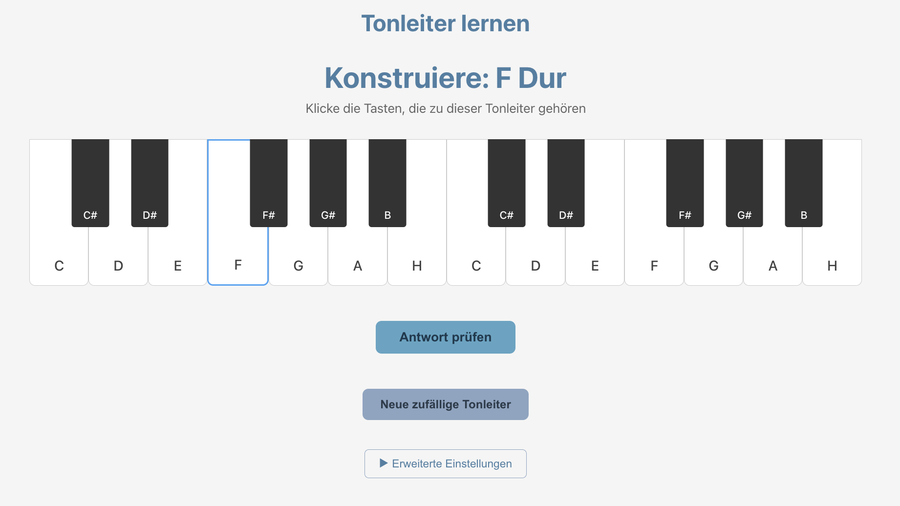

# Musical Scale Learning App

A simple web application that displays random major and minor scales to help you learn scale construction.

This is a vibe coded app created for my son to help him prepare for a test in music.



## Features

- Random scale generation on each page load
- Root notes: C, D, E, F, G, A, B (natural notes only)
- Scale types: Major and Minor
- Visual piano keyboard display
- Correct accidentals (e.g., F Major shows Bb)

## Getting Started

1. Install dependencies:

```bash
npm install
```

2. Start the development server:

```bash
npm run dev
```

3. Open your browser to the URL shown (typically http://localhost:5173)

4. Reload the page to see a new random scale!

## Build for Production

```bash
npm run build
```

The built files will be in the `dist` directory.
